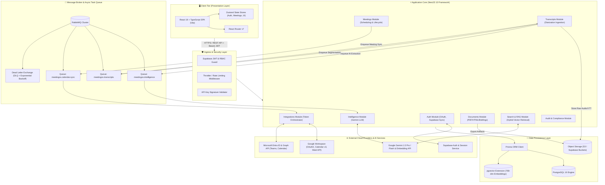
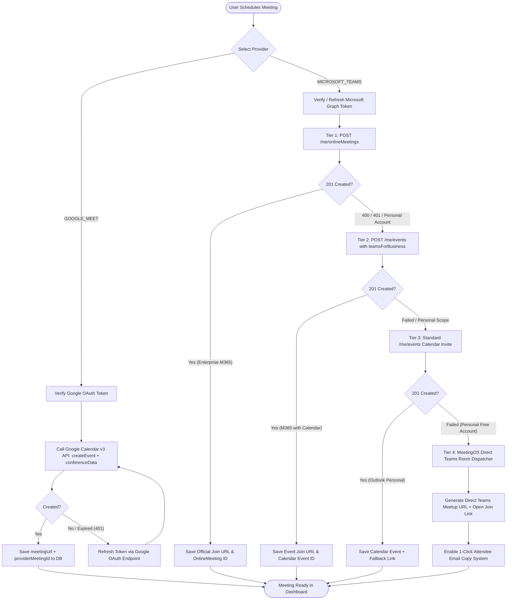
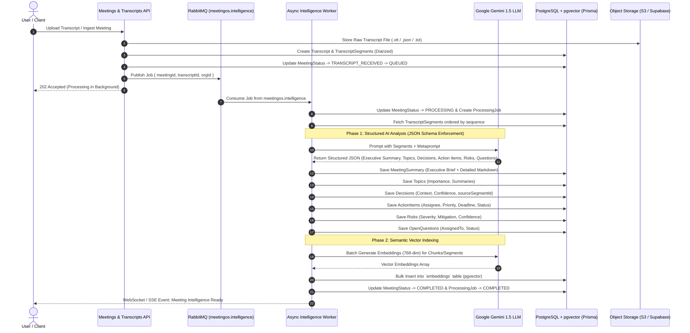
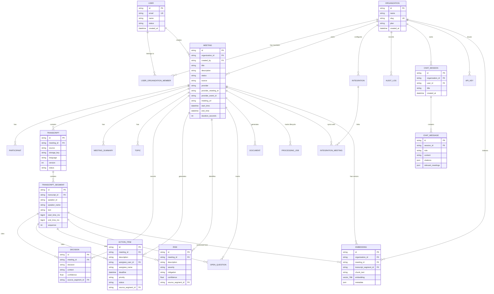
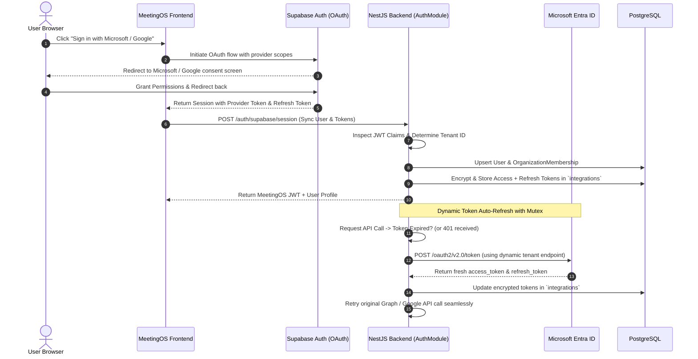

# MeetingOS System Design & Architectural Specification

An industry-grade, end-to-end technical system design and architectural specification for **MeetingOS** — an enterprise AI-powered meeting intelligence, automated scheduling, speaker diarization, and vector RAG platform.

---

## 1. System Overview & Core Capabilities

MeetingOS transforms disorganized multi-platform meetings into structured, actionable enterprise knowledge. Key capabilities include:

1. **Multi-Platform Automated Scheduling**: Direct integration with **Google Meet / Calendar** and **Microsoft Teams / Microsoft 365** with intelligent multi-tier fallback for enterprise vs. personal accounts.
2. **Transcript Processing & Speaker Diarization**: High-fidelity ingestion of raw transcripts, audio/video streams, and automated speaker alignment.
3. **Structured Intelligence Extraction**: Two-phase LLM processing via Google Gemini 1.5 Pro/Flash to generate executive summaries, key topics, decisions made, prioritized action items, and organizational risks.
4. **Vector RAG & Semantic Search**: 768-dimensional vector embeddings stored in **PostgreSQL + `pgvector`** enabling cross-meeting semantic query retrieval, citations, and interactive AI chat.
5. **Multi-Tenant Security & Role-Based Access Control (RBAC)**: Secure multi-tenancy with organization isolation, audit logging, and encrypted OAuth token orchestration.

---

## 2. Architecture Diagrams (Mermaid)

### 2.1 High-Level Container & Network Topology

---

### 2.2 Multi-Tier Video & Calendar Dispatch Engine

MeetingOS features a 4-tier fallback architecture to seamlessly support both Microsoft 365 Work/Enterprise tenants and personal Microsoft accounts without operational failures.

---

### 2.3 Asynchronous Intelligence & Vector RAG Pipeline

---

### 2.4 Entity Relationship Diagram (ERD)

---

### 2.5 Authentication & Dynamic Token Orchestration

---

## 3. Detailed Component Architecture

### 3.1 Frontend Architecture (`/frontend`)
- **Framework**: React 19 SPA powered by Vite and TypeScript.
- **State Management**: Reactive, split Zustand stores (`auth.store.ts`, `meeting.store.ts`) with zero-overhead re-renders.
- **Styling & UI**: Tailwind CSS, Lucide icons, and accessible modal dialogs with keyboard trapping and screen-reader support.
- **Resilience**:
  - Direct 1-click clipboard copy utility with automatic fallback to `document.execCommand('copy')` for non-HTTPS / legacy contexts.
  - Granular banner feedback for Enterprise vs. Personal accounts.

### 3.2 Backend Core (`/backend`)
- **Framework**: NestJS 10 modular architecture with strict dependency injection.
- **Data Access**: Prisma ORM with `@prisma/client` and custom PostgreSQL vector extensions.
- **Security & Authorization**:
  - Supabase JWT validation guard (`SupabaseAuthGuard`).
  - Role-Based Access Control (`OWNER`, `ADMIN`, `MEMBER`, `VIEWER`).
  - Scoped API key authentication (`ApiKeyGuard`) for programmatic integrations.
- **Modular Design**:
  - `AuthModule`: User onboarding, OAuth synchronization, tenant resolution.
  - `MeetingsModule`: Meeting scheduling, CRUD, state machine transitions.
  - `IntegrationsModule`: Google Calendar & Microsoft Graph API dispatch engine with multi-tier fallback.
  - `TranscriptsModule`: Ingestion, diarization mapping, and segment timestamp indexing.
  - `IntelligenceModule`: Google Gemini 1.5 LLM pipeline, prompt engineering, structured JSON extraction.
  - `SearchModule`: Hybrid vector + full-text search leveraging `pgvector` cosine similarity.
  - `DocumentsModule`: Markdown, PDF, and executive briefing compilation.
  - `QueueModule`: RabbitMQ publisher & consumer management with exponential backoff.

### 3.3 Persistence & Vector Engine
- **Relational DB**: PostgreSQL 16 with optimized composite indexing on `[organization_id, status]` and `[organization_id, created_at]`.
- **Vector Search (`pgvector`)**:
  - Dimension: `768` (Google Gemini text-embedding-004 / gecko standard).
  - Search Query: Cosine distance `<->` operator with threshold filtering and tenant isolation (`organization_id = :orgId`).
- **Object Storage**: S3-compatible / Supabase Storage for raw audio files, uploaded `.vtt` transcripts, and generated PDF documents.

---

## 4. Edge Cases & Resilience Strategy Matrix

| Edge Case / Failure Mode | System Impact | Mitigation / Architectural Defense |
| :--- | :--- | :--- |
| **Personal Microsoft Account (Graph 400/401)** | User cannot create calendar events via `/me/onlineMeetings` | **4-Tier Fallback**: Automatically downgrades to direct open Teams room link and provides 1-click bulk attendee email copying. |
| **Token Expiry During Long Operations** | Upstream API calls to Google/Microsoft fail with 401 | **Proactive & Reactive Refresh**: Checks token expiration timestamp prior to requests; intercepts 401s, refreshes via dynamic tenant endpoint, and retries. |
| **RabbitMQ Worker Crash / OOM** | Processing job left in `PROCESSING` status | **Dead Letter Queue & Acknowledgment**: Jobs use manual ACK (`ack` after completion). Unacknowledged messages re-queue with exponential backoff; persistent failures route to DLQ. |
| **Gemini LLM Rate Limiting (429)** | Intelligence extraction temporarily blocked | **Retry with Jitter**: Exponential backoff with random jitter across 3 attempts; fallback to secondary model tier (Gemini 1.5 Flash). |
| **Cross-Tenant Data Leakage** | User queries meetings from another organization | **Tenant Isolation**: Every database query and vector similarity scan mandates `organizationId` matching in Prisma `where` clauses. |
| **Clipboard Copy in Insecure Contexts** | Clipboard API blocked without HTTPS | **Dual-Engine Copy**: Tries modern `navigator.clipboard.writeText`, falls back to hidden `textarea` + `document.execCommand('copy')`. |

---

## 5. Summary & Reference

- **Mermaid Source File**: [docs/architecture/system_design.mmd](file:///Users/aryangautam/Desktop/MeetingOS/docs/architecture/system_design.mmd)
- **Database Schema**: [backend/prisma/schema.prisma](file:///Users/aryangautam/Desktop/MeetingOS/backend/prisma/schema.prisma)
- **Frontend Codebase**: [frontend/src](file:///Users/aryangautam/Desktop/MeetingOS/frontend/src)
- **Backend Codebase**: [backend/src](file:///Users/aryangautam/Desktop/MeetingOS/backend/src)
